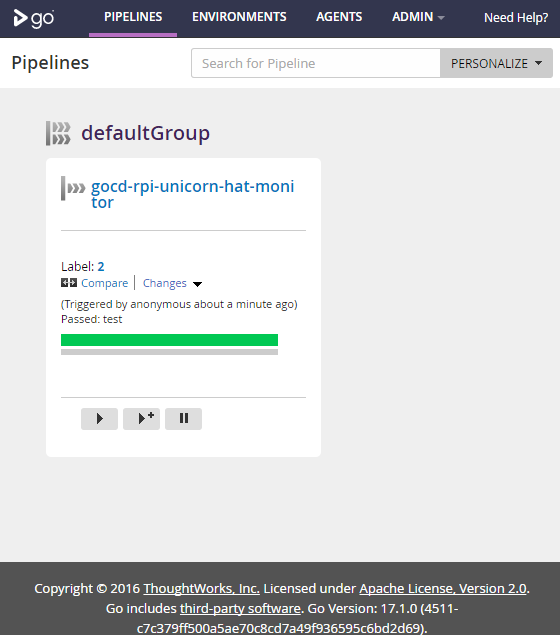

# GoCD as Code

a simple [GoCD](https://www.gocd.io/) demo environment that completely provisions itself and adds a [pipeline](https://github.com/d-led/cctray-rpi-unicorn-hat-monitor) (as a [YAML](https://github.com/tomzo/gocd-yaml-config-plugin) config) via the [REST API](https://api.gocd.io/).

## summary

the startup sequence:

- the Go server
- two different agents start
- agents wait to connect to the server
- the provisioner waits some, and adds the pipeline to the config
- the server picks up the config and starts a build
- ...

## up and running

```
docker-compose up -d
```

## access the instance

- http://[go-server-ip]:8153



## shutdown

```
docker-compose stop
```

or destroy via:

```
docker-compose down --remove-orphans
```
